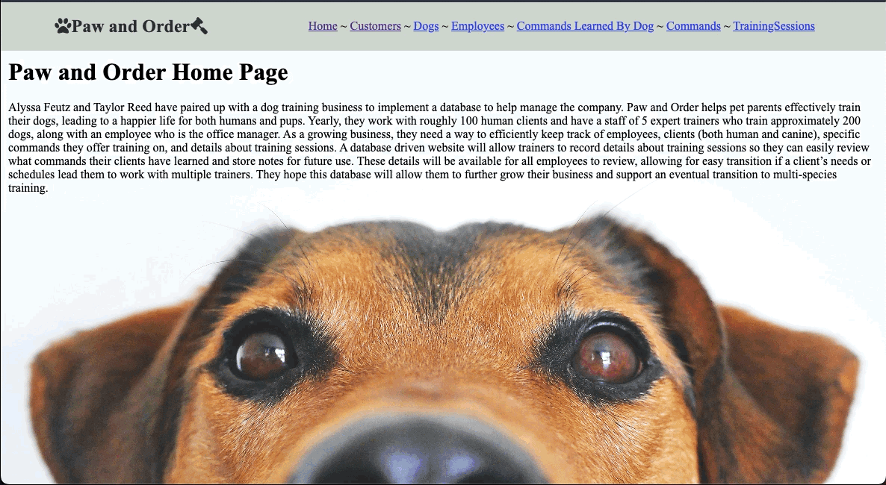

# PawAndOrder
Working as a team, Alyssa Feutz and I created a database and UI that Paw and Order, a fictional dog training business, can use to streamline their day-to-day operations. Users can access data on business employees, customers, dogs, individual training sessions, commands taught by trainers, and commands that have been learned by individual dogs. The project was created using Python, Flask, CSS, and a MySQL database. 

Alyssa Feutz and Taylor Reed (March 2023) Citing source code "Flask Starter App" Source URL: https://github.com/osu-cs340-ecampus/flask-starter-app

Background images sourced from https://www.pexels.com/

1. Customers ~ Create, Read, Update, Delete

2. Dogs ~ Create, Read, Update, Delete

3. Employees ~ Create, Read

4. Commands & Commands Learned By Dog ~ Create, Read

5. Training Sessions ~ Create, Read

Entity Relationship Diagram

Visual Schema

